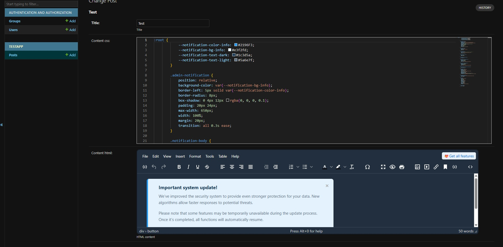

 # Django Admin Style Linker

[](https://badge.fury.io/py/django-admin-style-linker)

A simple Django admin mixin to link a CSS editor field ([MonacoEditor](https://github.com/john-psina/django-admin-monaco-editor)) with an HTML editor field ([TinyMCE](https://github.com/jazzband/django-tinymce)) for a live preview. When a user types CSS, it's instantly applied to the content in the HTML editor's iframe.

## Features
- Easy to integrate with any `ModelAdmin`.
- Works with separate CSS and HTML fields.
- Optional support for [django-modeltranslation](https://github.com/deschler/django-modeltranslation).

## Installation

```bash
pip install django-admin-style-linker
```

Add `admin_style_linker` to your `INSTALLED_APPS` in `settings.py` and configure TinyMCE:

```python
INSTALLED_APPS = [
    # ...
    'django_monaco_editor',
    'tinymce',
    'admin_style_linker',
    # ...
]

# Important
# You need to add this setup to your TinyMCE settings for django-admin-style-linker to work properly.
TINYMCE_DEFAULT_CONFIG = {
    "setup": """function (editor) {
        const event = new CustomEvent('tinyMceAllEditorsInit', { detail: [editor] });
        document.dispatchEvent(event);
    }""",

    # other TinyMCE settings
}
```

## Usage

In your `admin.py`, inherit from `LinkStyleAdminMixin` and configure the `link_styles` attribute.

`link_styles` is a list of dictionaries, where each dictionary specifies one style field and one or more HTML fields it should apply to.

**Example:**

```python
from django.contrib import admin
from .models import MyModel
from admin_style_linker import LinkStyleAdminMixin

@admin.register(MyModel)
class MyModelAdmin(LinkStyleAdminMixin, admin.ModelAdmin):
    # ... other admin settings

    link_styles = [
        {
            'styles_field': 'custom_css',  # The name of the field with CSS
            'html_fields': ['content_html', 'another_html_field'], # A list of fields with HTML
        },
    ]
```



## Django Modeltranslation Support

The mixin automatically detects if `django-modeltranslation` is installed and intelligently handles translated fields. You don't need any special configuration—just use the **base field names** in your `link_styles` setup, and the mixin will figure out the rest.

Here are a few common scenarios:

---

### Scenario 1: Both Style and HTML Fields are Translatable (Most common)

When both the CSS field and the HTML field(s) are registered for translation, the mixin will link fields of the same language together.

**`translation.py`:**
```python
from modeltranslation.translator import register, TranslationOptions
from .models import MyModel

@register(MyModel)
class MyModelTranslationOptions(TranslationOptions):
    fields = ('styles', 'content')
```

**`admin.py`:**
```python
@admin.register(MyModel)
class MyModelAdmin(LinkStyleAdminMixin, admin.ModelAdmin):
    link_styles = [
        {
            'styles_field': 'styles',       # Base name
            'html_fields': ['content'],     # Base name
        },
    ]
```

**Result:**
The mixin will automatically create the following links:
*   `styles_en` will apply to `content_en`.
*   `styles_uk` will apply to `content_uk`.
*   ...and so on for all your `LANGUAGES`.

---

### Scenario 2: Non-Translatable Styles for Translatable HTML

Use one common CSS field to style all language versions of your HTML content.

**`translation.py`:**
```python
@register(MyModel)
class MyModelTranslationOptions(TranslationOptions):
    fields = ('content',) # Only 'content' is translatable
```

**`admin.py`:**
```python
@admin.register(MyModel)
class MyModelAdmin(LinkStyleAdminMixin, admin.ModelAdmin):
    link_styles = [
        {
            'styles_field': 'global_styles', # Not a translatable field
            'html_fields': ['content'],      # Translatable field
        },
    ]
```

**Result:**
The `global_styles` field will apply to **all** language versions of the `content` field:
*   `global_styles` → `content_en`
*   `global_styles` → `content_uk`

---

### Scenario 3: Translatable Styles for a Non-Translatable HTML Field

If your style field is translatable but the HTML field is not, the mixin will link the non-translatable field only to the style field of the **default language** (`settings.LANGUAGE_CODE`).

**`translation.py`:**
```python
@register(MyModel)
class MyModelTranslationOptions(TranslationOptions):
    fields = ('styles',) # Only 'styles' is translatable
```

**`admin.py`:**
```python
@admin.register(MyModel)
class MyModelAdmin(LinkStyleAdminMixin, admin.ModelAdmin):
    link_styles = [
        {
            'styles_field': 'styles',          # Translatable field
            'html_fields': ['footer_html'],    # NOT a translatable field
        },
    ]
```

**Result:**
Assuming your default language is English (`en`):
*   `styles_en` will apply to `footer_html`.
*   Other style versions (`styles_uk`, etc.) will not be linked to `footer_html`.

---

## How it Works
The mixin injects `data-*` attributes into the widgets of the specified fields during form rendering. A JavaScript file then listens for changes in the `data-style-source-for` field and injects its content as a `<style>` tag into the `<iframe>` of the corresponding `data-style-target-of` editor.
